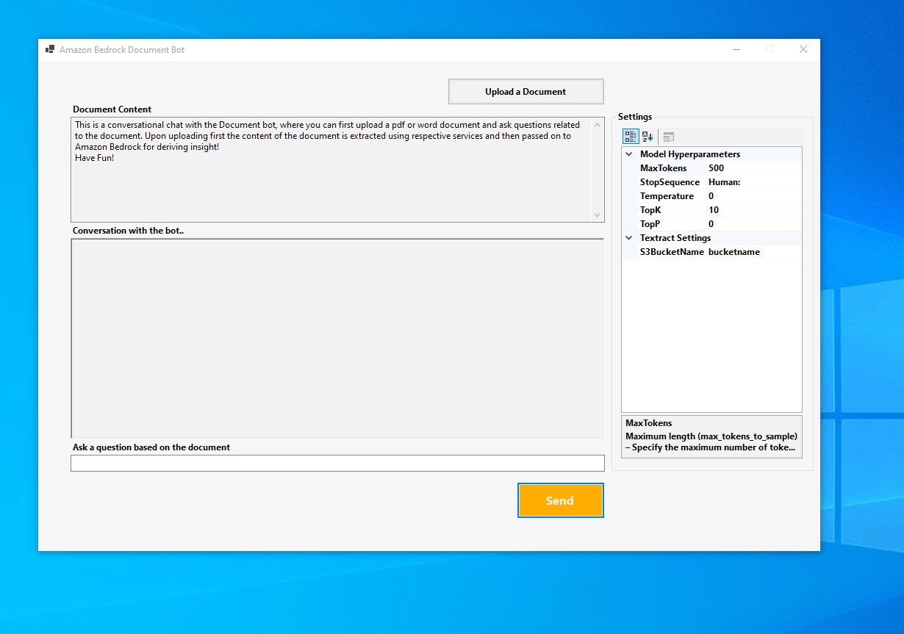

# Building a Conversational Document Bot on Amazon Bedrock, Amazon Textract with .NET Windows Forms 

The conversational document bot allows users to upload a file (either PDF or Word) and ask questions about its content. The history is persisted for the session, any follow up questions that the user asks, the bot keeps track of the conversation history and responds based on the context of the whole conversation. It is important to note that the number of tokens (tokens are basic unit of text which LLM processes and generates. 750 words ~=1000 tokens) that you can pass to a model is based on the input token capacity for the model you are going to leverage. There are multiple ways to handle the token limitation of the model and it is discussed below.  

The app provides settings which control the behavior of document extraction and model responses.  

The Sample provided here is [**covered in a Blog**](https://aws-blogs-prod.amazon.com/dotnet/document-bot-on-amazon-bedrock-with-net-windows-forms/), which includes detailed walkthrough of the sample and use case

## Getting started

Befor you run the app, maker sure the prerquisites mentioned below are installed and configured.

- you will need a S3 bucket for storing the pdf that will be consumed by Amazon Textract service to extract text. If you do not already have the bucket, create one and ensure you have proper rights given to the user which is configured in the profile. 
- The application when run, shows the settings grid on the side. You should change the S3 bucketname before you run inference.

## Dev Environment Prerequisite

This sample has been developed using:
- .Net 8.0
- AWSSDK.BedrockRuntime 3.7
- AWSSDK.S3 3.7
- AWSSDK.Textract 3.7
- DocumentFormat.OpenXml 3.0

If you are using Visual Studio 2022, install the .Net 8.0 SDK. The sample was developed using Visual Studio version 17.8.7.
If you use Nuget for package installation, you can find the [installables here](https://www.nuget.org/packages?q=AWSdotnet)

## AWS Account Prequisite
You will need an AWS account to test this sample. The [documentation](https://docs.aws.amazon.com/bedrock/latest/userguide/setting-up.html) here explains in details how to create an AWS Account and setup Bedrock. 

Once you have the AWS account setup, you can then setup access to Amazon Bedrock models. This is not by default enabled and you can [**follow instructions explained here**](https://docs.aws.amazon.com/bedrock/latest/userguide/model-access.html) for enabling access. 

**IMPORTANT NOTE - Amazon Bedrock is not available on free tier and any inference executed will be charged. You can understand [Amazon Bedrock pricing here](https://aws.amazon.com/bedrock/pricing/)**
## Configuring AWS SDK for .NET 

The [AWS SDK for .NET](https://docs.aws.amazon.com/sdk-for-net/v3/developer-guide/welcome.html) makes it easier to build .NET applications that tap into cost-effective, scalable, and reliable AWS services such as Amazon Bedrock, Amazon Simple Storage Service (Amazon S3) and Amazon Textract. The SDK simplifies the use of AWS services by providing a set of libraries that are consistent and familiar for .NET developers. 

This [documentation](https://docs.aws.amazon.com/sdk-for-net/v3/developer-guide/creds-idc.html) will provide detailed walkthrough of se setting SDK access control to your AWS account

### A brief about how you call various Amazon services using AWS .NET SDK 

The AWS SDK for .NET uses a client request model to simplify communication with AWS services. Here are some key aspects of the model: 

- The SDK provides client classes for each AWS service, such as AmazonTextractClient and AmazonS3Client. These client classes handle authentication, request signing and retries behind the scenes.  

- Developers make API calls on the client objects to interact with AWS services.  

- The clients serialize requests to JSON or XML and send them to AWS endpoints. It then deserializes the responses.  

- Common parameters like region are configured on the client and all requests use those parameters by default 

- Tasks like signing, error handling and retries are abstracted away, making the API intuitive for .NET developers to use AWS services.  

- Additional features like [asynchronous operations](https://docs.aws.amazon.com/sdk-for-net/v3/developer-guide/sdk-net-async-api.html) and low-level access are also possible. 

